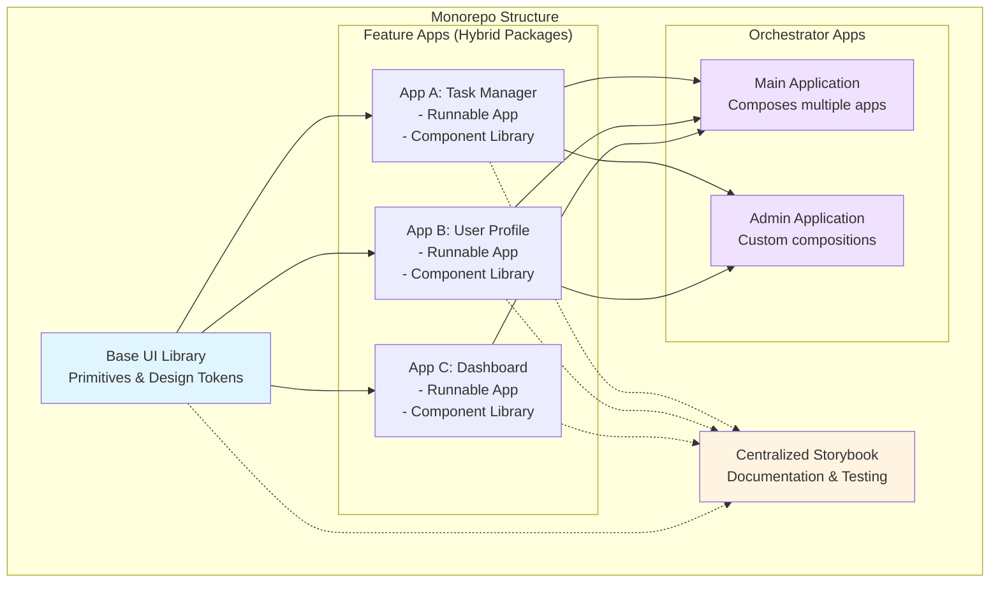
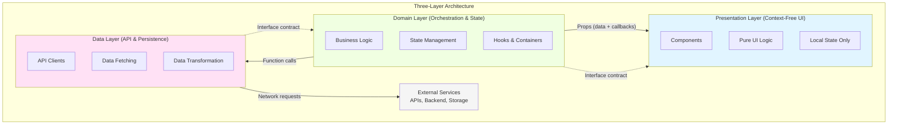
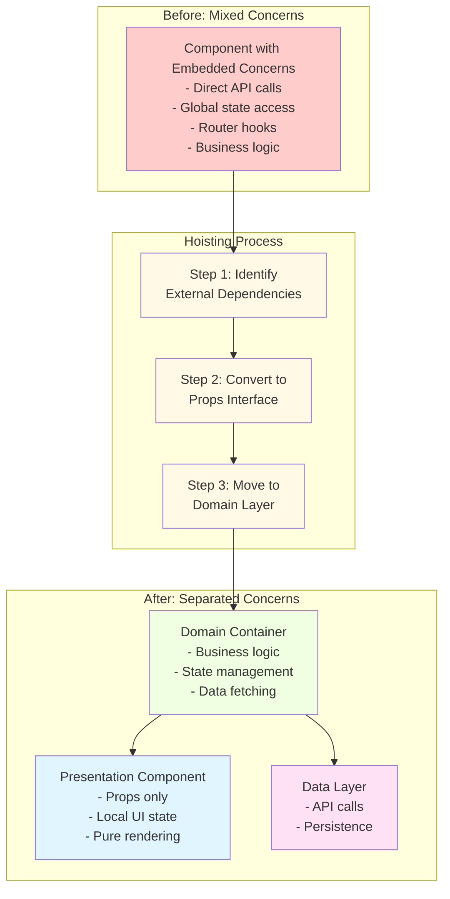
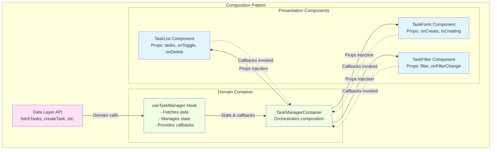
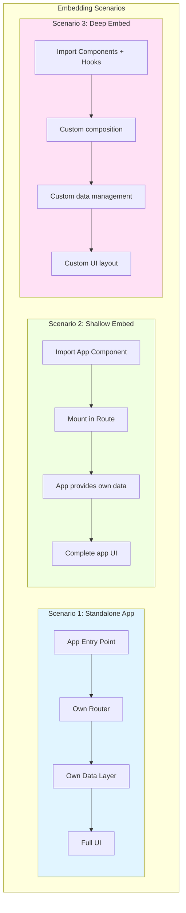
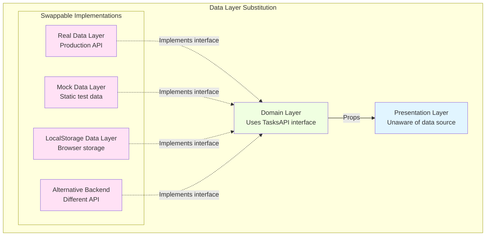

# Frontend Portability Pattern: Architecture

## Introduction & Goals

### Primary Goal: Scalable UI in a Monorepo

This architecture pattern is designed to enable the creation of **scalable user interfaces** within a monorepo environment. The pattern focuses on building UI that can grow in complexity while maintaining clear boundaries, consistent interfaces, and composability across packages.

Key aspects of scalability:

- **Component reuse** across multiple applications and packages
- **Clear separation of concerns** enabling independent development
- **Maintainable complexity** through well-defined layers and interfaces
- **Team scalability** where multiple teams can work on different layers independently

### Secondary Goal: Cross-Application Portability

While the primary focus is on scalable UI within the monorepo, a secondary benefit is the ability to **transfer frontend assets across applications**. By following the portability pattern, components and entire feature sets can be:

- Extracted and reused in different applications
- Shared across team boundaries
- Evolved independently from their consuming applications
- Tested and documented in isolation

### Monorepo Context: Apps as Feature-Rich Component Libraries

In this pattern, each application within the monorepo serves a **dual purpose**:

1. **Runnable Application**: Standalone app that can be deployed and run independently
2. **Component Library**: Exportable collection of components, hooks, and utilities that other apps can import

This hybrid approach means:

- Apps expose both a complete application entry point AND reusable building blocks
- Teams can choose to embed an entire app OR compose custom UIs from its parts
- The monorepo becomes a rich ecosystem of interoperable UI components
- Code reuse happens naturally through package imports rather than copy-paste

## Monorepo Architecture

### Hybrid App/Package Pattern

Each "app" in the monorepo is structured to support three consumption scenarios:

1. **Standalone Deployment**: The app can be built and deployed as an independent application
2. **Shallow Embedding**: The entire app can be mounted within another app (e.g., as a route)
3. **Deep Embedding**: Individual components and hooks can be imported for custom composition

This is achieved by carefully designing the package's public API to expose:

- A top-level application component (for standalone and shallow embedding)
- Individual layer components (presentation, domain, data)
- Hooks and utilities for custom integration
- Type definitions for all public interfaces



**Diagram 1**: Monorepo package structure showing how apps serve as both runnable applications and importable component libraries. The base UI library provides foundation primitives, while orchestrator apps compose multiple feature apps.

### Base UI Component Library

The architecture assumes a **base UI component library** that provides:

- **Primitive components**: buttons, inputs, cards, modals, etc.
- **Design tokens**: colors, spacing, typography, shadows
- **Common utilities**: theme provider, responsive hooks, accessibility helpers
- **Layout components**: grid systems, flex containers, spacing utilities

All apps in the monorepo depend on this shared foundation, ensuring:

- Visual consistency across all applications
- Reduced duplication of low-level UI code
- Single source of truth for design system
- Easier maintenance and updates to core UI

Example base UI exports:

```typescript
// @company/ui-library
export { Button, Input, Card, Modal } from './components';
export { theme, ThemeProvider } from './theme';
export { useResponsive, useBreakpoint } from './hooks';
export type { Theme, ComponentProps } from './types';
```

### Centralized Storybook

A **centralized Storybook instance** serves all UI-exposing packages in the monorepo:

- Single documentation portal for all components
- Shared configuration and addons
- Cross-package component discovery
- Isolated component development and testing
- Visual regression testing capabilities

Benefits:

- **Unified documentation**: Developers can find any component in one place
- **Consistency**: Shared Storybook configuration ensures uniform documentation
- **Testing**: Components can be tested in isolation before integration
- **Design review**: Designers can review components without running apps

### Package Dependency Graph & Boundaries

Clear dependency rules prevent circular dependencies and maintain architectural integrity:

**Allowed Dependencies:**

- Feature apps → Base UI library (always)
- Orchestrator apps → Feature apps (compose)
- Orchestrator apps → Base UI library (direct usage)
- Any package → Storybook (documentation)

**Forbidden Dependencies:**

- Base UI library → Feature apps (would create coupling)
- Feature apps → Orchestrator apps (wrong direction)
- Circular dependencies between feature apps (use shared packages instead)

**Dependency Management Strategy:**

- Use exact versions or tight ranges for prerequisite dependencies (React, TypeScript)
- Use workspace protocol for internal monorepo dependencies
- Document peer dependency requirements clearly
- Automated tooling to detect dependency violations

## Core Pattern: Three-Layer Architecture

The foundation of portability is a clear separation of concerns into three distinct layers, each with specific responsibilities and well-defined interfaces.



**Diagram 2**: Three-layer architecture showing the separation between Presentation (context-free UI), Domain (orchestration and state), and Data (API access). Solid arrows show data flow, dashed arrows show interface contracts.

### Data Layer: Frontend API

**Responsibility**: Provide a clean API for accessing and mutating data, isolating all network and persistence concerns.

**Key characteristics:**

- All `fetch`, `axios`, GraphQL queries, or other network calls live here
- Transforms raw API responses (DTOs) into domain-shaped data models
- Abstracts away transport concerns (REST vs GraphQL vs WebSocket)
- Swappable implementations (real, mock, alternative backends)

**Interface contract:**

```typescript
// data/tasks.ts
export interface Task {
  id: string;
  title: string;
  completed: boolean;
}

export async function fetchTasks(userId: string): Promise<Task[]>;
export async function createTask(data: CreateTaskInput): Promise<Task>;
export async function updateTask(id: string, updates: Partial<Task>): Promise<Task>;
export async function deleteTask(id: string): Promise<void>;
```

**Rules:**

- Domain and Presentation layers never directly call network APIs
- Data functions return domain-shaped data, not raw transport objects
- The interface can be implemented multiple ways (real API, mock data, localStorage)
- Data layer has no knowledge of UI or business logic

### Domain Layer: State Orchestration

**Responsibility**: Own all business logic, application state, and workflow orchestration. Glue together Data and Presentation layers.

**Key characteristics:**

- Implements hooks and container components that own state
- Calls Data layer functions to fetch and mutate data
- Transforms domain data into props for Presentation components
- Handles side effects (analytics, notifications, navigation)
- Contains application-specific logic and workflows

**Interface contract:**

```typescript
// domain/useTaskManager.ts
export interface TaskManagerState {
  tasks: Task[];
  isLoading: boolean;
  error: Error | null;
  createTask: (title: string) => Promise<void>;
  toggleComplete: (taskId: string) => Promise<void>;
  deleteTask: (taskId: string) => Promise<void>;
  refresh: () => Promise<void>;
}

export function useTaskManager(userId: string): TaskManagerState;
```

**Rules:**

- All business logic lives in Domain (no logic in Presentation or Data)
- Domain talks to Data via the data layer API
- Domain passes plain data + callback props down to Presentation
- Domain must not depend on Presentation internals

### Presentation Layer: Context-Free UI

**Responsibility**: Display user interface based on props, with no knowledge of where data comes from or how actions are performed.

**Key characteristics:**

- Components receive all data via props (no context, no hooks for external state)
- Local state is limited to UI concerns (open/closed, selected tab, input values)
- Callbacks are invoked for any action that affects external state
- Components are pure UI widgets that can be rendered anywhere

**Interface contract:**

```typescript
// presentation/TaskList.tsx
export interface TaskListProps {
  tasks: Task[];
  isLoading: boolean;
  onToggleComplete: (taskId: string) => void;
  onDeleteTask: (taskId: string) => void;
}

export function TaskList(props: TaskListProps): JSX.Element;
```

**Rules:**

- No direct data fetching (no `fetch`, `useQuery`, etc.)
- No direct access to global state, router, or service clients
- All non-local state injected via props
- Only UI-local state remains internal (collapse, filter, input)

### Layer Dependency Rules

The three layers communicate through well-defined interfaces with strict dependency rules:

**Allowed:**

- Presentation ← Domain (via props)
- Domain → Data (via function calls)
- Domain → Presentation (via rendering)
- Data → External services (via network)

**Forbidden:**

- Presentation → Domain (components don't import domain logic)
- Presentation → Data (components don't fetch data)
- Data → Domain (data layer doesn't know about state management)
- Data → Presentation (data layer doesn't know about UI)

**Interface Contracts:**

Each layer exposes a typed interface:

- Data layer exports functions and types
- Domain layer exports hooks and types
- Presentation layer exports components and prop types

Changes within a layer don't affect other layers as long as the interface remains stable.

## Technical Strategy: Hoisting Algorithm

The **hoisting algorithm** is the core technical strategy that enables the three-layer architecture and makes components portable. It's a systematic refactoring process that extracts application concerns from components.

### What Hoisting Accomplishes

Hoisting transforms a tightly-coupled component (with embedded data fetching, global state access, and side effects) into:

1. A **clean presentation component** that receives all dependencies via props
2. A **domain container** that owns the hoisted concerns and provides them to the presentation

This separation is what makes components:

- Portable across applications
- Testable in isolation
- Reusable in different contexts
- Documented in Storybook

### Why It's Central to Portability

Without hoisting, components are bound to specific:

- Authentication systems
- Routing libraries
- State management solutions
- API clients
- Application context

Hoisting breaks these bindings, making components **context-free**. A hoisted component can be:

- Rendered in any app that provides the required props
- Tested without mocking complex application infrastructure
- Documented in Storybook with representative data
- Reused in contexts the original author never envisioned

### The Hoisting Process Visualized



**Diagram 3**: The hoisting process flow showing transformation from a component with mixed concerns to separated presentation and domain layers. The three-step algorithm systematically extracts and relocates application dependencies.

### Detailed Implementation Guide

For a comprehensive guide to the hoisting algorithm, including:

- Conceptual overview of why hoisting creates portability
- Step-by-step algorithm (identify, convert, move)
- Implementation details and decision trees
- Refactoring patterns for common scenarios
- Before/after code examples
- Testing strategies for hoisted components

See: **[Hoisting Algorithm: Technical Strategy](./technical-strategy/hoisting-algorithm.md)**

## Compositional UI Techniques

With components organized into three layers, we use **composition** to build complete features and applications from smaller, reusable pieces.



**Diagram 4**: Composition pattern showing how the domain layer orchestrates data fetching and provides props to multiple presentation components. Data flows down, callbacks flow up.

### How Layers Connect Through Composition

**Domain orchestrates, Presentation renders:**

The domain layer acts as the "composer," bringing together:

1. Data from the Data layer
2. State management and business logic
3. Multiple presentation components

```typescript
// Domain container composes presentation components
function TaskManagerContainer() {
  const { tasks, isLoading, createTask, toggleComplete, deleteTask } = useTaskManager();
  const [filter, setFilter] = useState('all');
  
  return (
    <div>
      <TaskFilter filter={filter} onFilterChange={setFilter} />
      <TaskForm onCreate={createTask} isCreating={isLoading} />
      <TaskList 
        tasks={tasks} 
        onToggle={toggleComplete}
        onDelete={deleteTask}
      />
    </div>
  );
}
```

**Composition enables flexibility:**

Different domain containers can compose the same presentation components in different ways:

```typescript
// Minimal view: just the list
function MinimalTaskView() {
  const { tasks } = useTaskManager();
  return <TaskList tasks={tasks} onToggle={() => {}} onDelete={() => {}} />;
}

// Dashboard widget: tasks with summary
function TaskDashboardWidget() {
  const { tasks, ...actions } = useTaskManager();
  return (
    <>
      <TaskSummary tasks={tasks} />
      <TaskList tasks={tasks} {...actions} />
    </>
  );
}

// Full featured: all components
function FullTaskManager() {
  const state = useTaskManager();
  return (
    <>
      <TaskFilter {...state} />
      <TaskForm {...state} />
      <TaskList {...state} />
      <TaskAnalytics tasks={state.tasks} />
    </>
  );
}
```

### Props Injection Patterns

**Pattern 1: Direct props spread**

```typescript
function Container() {
  const domainState = useDomainHook();
  return <PresentationComponent {...domainState} />;
}
```

**Pattern 2: Props transformation**

```typescript
function Container() {
  const { data, actions } = useDomainHook();
  
  // Transform domain data to presentation props
  const presentationProps = {
    items: data.map(transformItem),
    onSelect: (id) => actions.select(id),
    isActive: data.length > 0,
  };
  
  return <PresentationComponent {...presentationProps} />;
}
```

**Pattern 3: Multiple component composition**

```typescript
function Container() {
  const state = useDomainHook();
  
  return (
    <>
      <Header title={state.title} onAction={state.handleAction} />
      <Content data={state.data} isLoading={state.isLoading} />
      <Footer summary={state.summary} />
    </>
  );
}
```

**Pattern 4: Conditional composition**

```typescript
function Container() {
  const { data, isLoading, error } = useDomainHook();
  
  if (isLoading) return <LoadingSpinner />;
  if (error) return <ErrorMessage error={error} />;
  if (!data.length) return <EmptyState />;
  
  return <ContentView data={data} />;
}
```

### Container/Component Pattern

The **Container/Component pattern** (also called Smart/Dumb or Stateful/Stateless) is a specific application of domain/presentation separation:

**Container (Smart, Stateful):**

- Lives in domain layer
- Manages state and side effects
- Calls data layer APIs
- Passes props to presentation components
- Named with "Container" suffix or "Connected" prefix

**Component (Dumb, Stateless):**

- Lives in presentation layer
- Receives props, renders UI
- Maintains only local UI state
- Pure, testable, portable

**Example:**

```typescript
// Presentation: pure UI component
export function UserProfile({ user, onSave, isSaving }: UserProfileProps) {
  const [name, setName] = useState(user.name);
  
  return (
    <form onSubmit={() => onSave({ name })}>
      <input value={name} onChange={e => setName(e.target.value)} />
      <button disabled={isSaving}>Save</button>
    </form>
  );
}

// Domain: container that provides data and handlers
export function UserProfileContainer({ userId }: { userId: string }) {
  const { user, updateUser, isSaving } = useUserData(userId);
  
  if (!user) return <LoadingSpinner />;
  
  return <UserProfile user={user} onSave={updateUser} isSaving={isSaving} />;
}
```

### Building Composite Features from Imported Packages

In a monorepo with multiple feature apps, you can build new features by composing imports:

```typescript
// In an orchestrator app, compose features from multiple packages
import { TaskList } from '@company/tasks';
import { UserAvatar, UserCard } from '@company/users';
import { CommentThread } from '@company/comments';

// Create a custom composite view
function ProjectDashboard({ projectId }: Props) {
  const { project, tasks, members } = useProjectData(projectId);
  
  return (
    <DashboardLayout>
      <Section title="Team">
        {members.map(member => (
          <UserCard key={member.id} user={member} />
        ))}
      </Section>
      
      <Section title="Tasks">
        <TaskList tasks={tasks} onToggle={handleToggle} onDelete={handleDelete} />
      </Section>
      
      <Section title="Discussion">
        <CommentThread threadId={project.discussionId} />
      </Section>
    </DashboardLayout>
  );
}
```

This approach:

- Reuses well-tested components from multiple packages
- Creates custom UIs without duplicating code
- Maintains consistency by using shared components
- Scales as new packages are added to the monorepo

## Embedding Scenarios

The three-layer architecture supports multiple ways to use and embed applications, from standalone deployment to deep integration.



**Diagram 5**: Three embedding scenarios showing different levels of integration. Standalone apps run independently, shallow embeds mount complete apps, deep embeds compose custom UIs from individual pieces.

### Scenario 1: Standalone Deployment

**Use case**: Deploy the application independently as its own product.

**How it works:**

```typescript
// apps/task-manager/src/main.tsx
import { TaskManagerApp } from './App';
import { DataProvider } from './data/provider';
import { AuthProvider } from '@company/auth';

ReactDOM.createRoot(document.getElementById('root')!).render(
  <AuthProvider>
    <DataProvider apiUrl={import.meta.env.VITE_API_URL}>
      <TaskManagerApp />
    </DataProvider>
  </AuthProvider>
);
```

**Package exports:**

```typescript
// apps/task-manager/package.json
{
  "name": "@company/task-manager",
  "main": "./dist/index.js",
  "types": "./dist/index.d.ts"
}

// apps/task-manager/src/index.ts
export { TaskManagerApp } from './App';
export type { TaskManagerProps } from './App';
```

**Characteristics:**

- Complete independence: own routing, auth, data providers
- Full control over environment and configuration
- Can be deployed to its own domain
- No dependencies on host application

### Scenario 2: Shallow Embedding

**Use case**: Mount an entire application within another application, typically as a route or page.

**How it works:**

```typescript
// Host application
import { TaskManagerApp } from '@company/task-manager';
import { Route } from 'react-router-dom';

function HostApp() {
  return (
    <Routes>
      <Route path="/tasks/*" element={<TaskManagerApp />} />
      <Route path="/profile/*" element={<UserProfileApp />} />
      <Route path="/dashboard" element={<DashboardApp />} />
    </Routes>
  );
}
```

**Shared context:**

The host app typically provides shared concerns:

```typescript
// Host provides auth and theme, embedded app handles its own data
function HostApp() {
  return (
    <AuthProvider>
      <ThemeProvider theme={companyTheme}>
        <Routes>
          <Route path="/tasks/*" element={<TaskManagerApp />} />
        </Routes>
      </ThemeProvider>
    </AuthProvider>
  );
}
```

**Props interface for shallow embedding:**

```typescript
export interface TaskManagerAppProps {
  // Optional: override default behavior
  apiUrl?: string;
  onTaskComplete?: (taskId: string) => void;
  
  // Optional: customize appearance
  theme?: Theme;
  compact?: boolean;
}

export function TaskManagerApp(props: TaskManagerAppProps) {
  // App can use props to customize behavior
  const dataProvider = useDataProvider(props.apiUrl);
  
  return (
    <DataContext.Provider value={dataProvider}>
      <TaskManagerRouter />
    </DataContext.Provider>
  );
}
```

**Characteristics:**

- App retains internal structure (routing, data management)
- Host provides common infrastructure (auth, theme)
- Minimal integration effort
- App remains largely self-contained

### Scenario 3: Deep Embedding

**Use case**: Import individual components and hooks to build custom workflows and UIs.

**How it works:**

```typescript
// Host application composes custom UI from imported pieces
import { TaskList, TaskForm } from '@company/task-manager/presentation';
import { useTaskManager } from '@company/task-manager/domain';
import { UserCard } from '@company/users/presentation';

function CustomProjectView({ projectId }: Props) {
  const { tasks, createTask, toggleComplete } = useTaskManager(projectId);
  const { members } = useProjectMembers(projectId);
  
  return (
    <CustomLayout>
      <Sidebar>
        {members.map(member => (
          <UserCard key={member.id} user={member} size="small" />
        ))}
      </Sidebar>
      
      <MainContent>
        <TaskForm onCreate={createTask} />
        <TaskList tasks={tasks} onToggle={toggleComplete} />
      </MainContent>
    </CustomLayout>
  );
}
```

**Package exports for deep embedding:**

```typescript
// apps/task-manager/src/index.ts
// Export the complete app
export { TaskManagerApp } from './App';

// Export presentation layer
export { TaskList, TaskForm, TaskFilter, TaskCard } from './presentation';
export type { TaskListProps, TaskFormProps } from './presentation';

// Export domain layer
export { useTaskManager, useTaskFilters } from './domain';
export type { TaskManagerState } from './domain';

// Export data layer (for custom data management)
export { createTasksDataProvider } from './data';
export type { TasksAPI } from './data';

// Export types
export type { Task, TaskStatus, TaskPriority } from './types';
```

**Layer-based exports:**

```typescript
// Import from specific layers
import { TaskList } from '@company/task-manager/presentation';
import { useTaskManager } from '@company/task-manager/domain';
import { createTasksAPI } from '@company/task-manager/data';
```

**Characteristics:**

- Maximum flexibility: compose any combination
- Full control over layout and workflow
- Can mix components from multiple packages
- Requires understanding of component props and hooks
- Most powerful but requires most integration work

### Choosing the Right Scenario

**Use Standalone when:**

- Building a completely separate product
- Need full independence and isolation
- Want to deploy separately

**Use Shallow Embed when:**

- Integrating a complete feature/module
- Want minimal integration effort
- Feature is self-contained with clear boundaries
- Don't need to customize internal behavior

**Use Deep Embed when:**

- Building custom workflows across multiple domains
- Need fine-grained control over layout
- Composing features from multiple packages
- Creating unique experiences not supported by standalone apps

## Dependency Management

Effective dependency management is crucial for maintaining portability and preventing version conflicts in a monorepo environment.

### Prerequisites: Environment-Defining Dependencies

**Prerequisites** are dependencies that define or significantly affect the runtime environment. All apps in the monorepo should align on these:

**Core prerequisites:**

- **React** (and ReactDOM): UI framework
- **TypeScript**: Type system
- **Router**: React Router or alternative
- **Base UI library**: Shared component library
- **Theme system**: Styled-components, Emotion, Tailwind, etc.

**Why alignment matters:**

- Multiple React versions cause "hooks" errors
- TypeScript version mismatches cause type errors
- Different routers are incompatible
- UI libraries have incompatible component APIs

**Version strategy:**

```json
{
  "dependencies": {
    "react": "^18.2.0",
    "react-dom": "^18.2.0",
    "typescript": "^5.0.0",
    "react-router-dom": "^6.10.0",
    "@company/ui-library": "workspace:*"
  }
}
```

Use:

- **Exact versions** or **tight ranges** (^) for external prerequisites
- **Workspace protocol** (`workspace:*`) for internal monorepo packages
- **Peer dependencies** to declare requirements (optional, see below)

### Internal Dependencies: Implementation Details

**Internal dependencies** are implementation details hidden from consumers:

- Utility libraries (lodash, date-fns)
- Form libraries (formik, react-hook-form)
- Validation (zod, yup)
- HTTP clients (axios, ky)

**Rules:**

- Internal dependencies should NOT leak into public APIs
- Don't expose internal types in props or return values
- Keep internal dependencies as regular dependencies, not peer

**Example of leaking (bad):**

```typescript
// BAD: Exposes formik in public API
import { FormikValues } from 'formik';

export interface FormProps {
  initialValues: FormikValues; // ❌ Leaking formik
  onSubmit: (values: FormikValues) => void; // ❌ Leaking formik
}
```

**Example of encapsulation (good):**

```typescript
// GOOD: Uses domain types
export interface FormProps {
  initialValues: UserFormData; // ✅ Domain type
  onSubmit: (values: UserFormData) => void; // ✅ Domain type
}

// Internal implementation can use formik, but it's hidden
function FormImpl({ initialValues, onSubmit }: FormProps) {
  const formik = useFormik({
    initialValues,
    onSubmit,
  });
  
  // Formik is internal implementation detail
}
```

### Version Alignment Strategies in Monorepo

**Strategy 1: Workspace-wide version enforcement**

Use tools to enforce version consistency:

```bash
# Using syncpack to find mismatched versions
npx syncpack list-mismatches

# Fix mismatches automatically
npx syncpack fix-mismatches
```

**Strategy 2: Shared dependency configuration**

Create a shared package that re-exports common dependencies:

```json
// packages/common-deps/package.json
{
  "name": "@company/common-deps",
  "dependencies": {
    "react": "^18.2.0",
    "react-dom": "^18.2.0",
    "typescript": "^5.0.0"
  }
}
```

Other packages depend on this:

```json
{
  "dependencies": {
    "@company/common-deps": "workspace:*"
  }
}
```

**Strategy 3: Monorepo root dependencies**

Install shared dependencies at root level:

```json
// Root package.json
{
  "devDependencies": {
    "react": "^18.2.0",
    "typescript": "^5.0.0",
    "@testing-library/react": "^14.0.0"
  }
}
```

Apps use these via hoisting:

```json
// App package.json - react installed at root
{
  "peerDependencies": {
    "react": "^18.2.0"
  }
}
```

**Strategy 4: Automated checks in CI**

Add checks to prevent version drift:

```yaml
# .github/workflows/check-deps.yml
- name: Check dependency versions
  run: |
    npx syncpack list-mismatches
    # Fail if mismatches found
```

### Peer Dependencies Considerations

**When to use peer dependencies:**

- For prerequisites that consuming apps must provide
- To avoid duplicate installations of React, etc.
- When you want version flexibility for consumers

**When NOT to use peer dependencies:**

- For internal implementation details
- When you need a specific version guaranteed
- If dealing with NPM < v7 and want to avoid hassle

**Example:**

```json
{
  "peerDependencies": {
    "react": "^18.0.0",
    "react-dom": "^18.0.0",
    "@company/ui-library": "^2.0.0"
  },
  "dependencies": {
    "lodash": "^4.17.21",
    "date-fns": "^2.29.0"
  }
}
```

In modern monorepos with NPM v7+, peer dependencies work well and help enforce version alignment.

## Public API Surface

Carefully designing what to expose and what to keep internal is essential for maintaining portability and preventing tight coupling.

### Exposing "Sum and Parts"

Each package should export:

1. **The Sum**: Top-level application or feature component
2. **The Parts**: Individual building blocks for custom composition

```typescript
// src/index.ts
// ============
// THE SUM
// ============
export { TaskManagerApp } from './App';
export type { TaskManagerAppProps } from './App';

// ============
// THE PARTS
// ============

// Presentation layer components
export { 
  TaskList, 
  TaskForm, 
  TaskCard, 
  TaskFilter,
  TaskSummary 
} from './presentation';

export type {
  TaskListProps,
  TaskFormProps,
  TaskCardProps,
  TaskFilterProps,
  TaskSummaryProps
} from './presentation';

// Domain layer hooks
export {
  useTaskManager,
  useTaskFilters,
  useTaskAnalytics
} from './domain';

export type {
  TaskManagerState,
  TaskFiltersState,
  TaskAnalyticsState
} from './domain';

// Data layer (for advanced customization)
export { createTasksAPI } from './data';
export type { TasksAPI, TasksAPIConfig } from './data';

// Shared types
export type {
  Task,
  TaskStatus,
  TaskPriority,
  TaskFilter,
  CreateTaskInput,
  UpdateTaskInput
} from './types';
```

### Package Exports Structure

Use package.json `exports` field for fine-grained control:

```json
{
  "name": "@company/task-manager",
  "exports": {
    ".": {
      "types": "./dist/index.d.ts",
      "import": "./dist/index.js"
    },
    "./presentation": {
      "types": "./dist/presentation/index.d.ts",
      "import": "./dist/presentation/index.js"
    },
    "./domain": {
      "types": "./dist/domain/index.d.ts",
      "import": "./dist/domain/index.js"
    },
    "./data": {
      "types": "./dist/data/index.d.ts",
      "import": "./dist/data/index.js"
    },
    "./types": {
      "types": "./dist/types/index.d.ts",
      "import": "./dist/types/index.js"
    }
  }
}
```

This enables layer-specific imports:

```typescript
import { TaskManagerApp } from '@company/task-manager';
import { TaskList } from '@company/task-manager/presentation';
import { useTaskManager } from '@company/task-manager/domain';
import { createTasksAPI } from '@company/task-manager/data';
```

### What to Expose vs Keep Internal

**Expose:**

- ✅ Top-level app component
- ✅ All presentation components with stable props
- ✅ Domain hooks with clear, stable interfaces
- ✅ Data layer factories and types
- ✅ Shared types and interfaces
- ✅ Utility functions with clear purpose
- ✅ Theme tokens and design system elements

**Keep internal:**

- ❌ Implementation details of components
- ❌ Private helper functions
- ❌ Internal state management details
- ❌ Raw API response types (DTOs)
- ❌ Temporary/experimental components
- ❌ Test utilities (export separately if needed)
- ❌ Build configuration

**Marking internal exports:**

```typescript
// Use naming conventions
export function useTaskManagerInternal() { } // ❌ Don't use
export function _useTaskManagerPrivate() { } // ❌ Don't use

// Better: Don't export at all
function useTaskManagerPrivate() { } // Only used in this file

// Or use separate internal entry point
// internal.ts (not exported in package.json)
export function useTaskManagerInternal() { }
```

**Documentation:**

Document the public API clearly:

```typescript
/**
 * TaskManagerApp - Complete task management application
 * 
 * @remarks
 * This is the main application component. It can be used standalone
 * or embedded within another application.
 * 
 * @example
 * ```tsx
 * <TaskManagerApp apiUrl="https://api.example.com" />
 * ```
 * 
 * @public
 */
export function TaskManagerApp(props: TaskManagerAppProps) { }

/**
 * @internal
 * Internal helper, do not use directly
 */
function internalHelper() { }
```

## Data Layer Substitution

One of the powerful benefits of the three-layer architecture is the ability to swap data layer implementations without affecting Domain or Presentation layers.



**Diagram 6**: Data layer substitution showing how different implementations (real API, mock, localStorage, alternative backend) can be swapped as long as they implement the same interface contract.

### Interface Contract Preservation

The key to substitutability is a **well-defined interface**:

```typescript
// data/types.ts
export interface TasksAPI {
  fetchTasks(userId: string): Promise<Task[]>;
  createTask(input: CreateTaskInput): Promise<Task>;
  updateTask(id: string, updates: Partial<Task>): Promise<Task>;
  deleteTask(id: string): Promise<void>;
}

export interface Task {
  id: string;
  title: string;
  completed: boolean;
  userId: string;
  createdAt: Date;
}
```

Any implementation that satisfies this interface can be used:

```typescript
// Domain uses the interface, not a specific implementation
function useTaskManager(userId: string, api: TasksAPI) {
  const [tasks, setTasks] = useState<Task[]>([]);
  
  useEffect(() => {
    api.fetchTasks(userId).then(setTasks);
  }, [userId, api]);
  
  const createTask = useCallback(async (input: CreateTaskInput) => {
    const task = await api.createTask(input);
    setTasks(prev => [...prev, task]);
  }, [api]);
  
  return { tasks, createTask };
}
```

### Implementation 1: Real API (Production)

```typescript
// data/real-api.ts
import { api } from './http-client';

export class RealTasksAPI implements TasksAPI {
  constructor(private baseUrl: string) {}
  
  async fetchTasks(userId: string): Promise<Task[]> {
    const response = await api.get(`${this.baseUrl}/tasks`, {
      params: { userId }
    });
    return response.data.map(toTask);
  }
  
  async createTask(input: CreateTaskInput): Promise<Task> {
    const response = await api.post(`${this.baseUrl}/tasks`, input);
    return toTask(response.data);
  }
  
  async updateTask(id: string, updates: Partial<Task>): Promise<Task> {
    const response = await api.patch(`${this.baseUrl}/tasks/${id}`, updates);
    return toTask(response.data);
  }
  
  async deleteTask(id: string): Promise<void> {
    await api.delete(`${this.baseUrl}/tasks/${id}`);
  }
}

function toTask(dto: TaskDTO): Task {
  return {
    id: dto.id,
    title: dto.title,
    completed: dto.completed,
    userId: dto.user_id,
    createdAt: new Date(dto.created_at),
  };
}
```

### Implementation 2: Mock API (Testing/Development)

```typescript
// data/mock-api.ts
export class MockTasksAPI implements TasksAPI {
  private tasks: Task[] = [
    { id: '1', title: 'Sample task 1', completed: false, userId: 'user1', createdAt: new Date() },
    { id: '2', title: 'Sample task 2', completed: true, userId: 'user1', createdAt: new Date() },
  ];
  
  async fetchTasks(userId: string): Promise<Task[]> {
    // Simulate network delay
    await delay(500);
    return this.tasks.filter(t => t.userId === userId);
  }
  
  async createTask(input: CreateTaskInput): Promise<Task> {
    await delay(300);
    const task: Task = {
      id: String(Date.now()),
      title: input.title,
      completed: false,
      userId: input.userId,
      createdAt: new Date(),
    };
    this.tasks.push(task);
    return task;
  }
  
  async updateTask(id: string, updates: Partial<Task>): Promise<Task> {
    await delay(300);
    const index = this.tasks.findIndex(t => t.id === id);
    if (index === -1) throw new Error('Task not found');
    
    this.tasks[index] = { ...this.tasks[index], ...updates };
    return this.tasks[index];
  }
  
  async deleteTask(id: string): Promise<void> {
    await delay(300);
    this.tasks = this.tasks.filter(t => t.id !== id);
  }
}

function delay(ms: number) {
  return new Promise(resolve => setTimeout(resolve, ms));
}
```

### Implementation 3: LocalStorage API (Offline/Demo)

```typescript
// data/localstorage-api.ts
export class LocalStorageTasksAPI implements TasksAPI {
  private storageKey = 'tasks';
  
  private getTasks(): Task[] {
    const data = localStorage.getItem(this.storageKey);
    return data ? JSON.parse(data) : [];
  }
  
  private saveTasks(tasks: Task[]): void {
    localStorage.setItem(this.storageKey, JSON.stringify(tasks));
  }
  
  async fetchTasks(userId: string): Promise<Task[]> {
    const tasks = this.getTasks();
    return tasks.filter(t => t.userId === userId);
  }
  
  async createTask(input: CreateTaskInput): Promise<Task> {
    const tasks = this.getTasks();
    const task: Task = {
      id: String(Date.now()),
      title: input.title,
      completed: false,
      userId: input.userId,
      createdAt: new Date(),
    };
    tasks.push(task);
    this.saveTasks(tasks);
    return task;
  }
  
  async updateTask(id: string, updates: Partial<Task>): Promise<Task> {
    const tasks = this.getTasks();
    const index = tasks.findIndex(t => t.id === id);
    if (index === -1) throw new Error('Task not found');
    
    tasks[index] = { ...tasks[index], ...updates };
    this.saveTasks(tasks);
    return tasks[index];
  }
  
  async deleteTask(id: string): Promise<void> {
    const tasks = this.getTasks();
    const filtered = tasks.filter(t => t.id !== id);
    this.saveTasks(filtered);
  }
}
```

### Use Cases for Each Implementation

**Real API (Production):**

- ✅ Production deployment
- ✅ Integration testing against real backend
- ✅ Performance testing with actual network latency

**Mock API (Development/Testing):**

- ✅ Local development without backend dependency
- ✅ Storybook stories with representative data
- ✅ Unit tests without network mocking
- ✅ Demo environments
- ✅ Consistent, predictable test data

**LocalStorage API (Offline/Demo):**

- ✅ Offline-first applications
- ✅ Demo apps without backend
- ✅ User-specific client-side storage
- ✅ Progressive Web Apps (PWA)

**Alternative Backend API:**

- ✅ Migrating between backends
- ✅ Supporting multiple backend versions
- ✅ A/B testing different APIs
- ✅ Multi-tenant with different data sources

### Providing the Data Layer to Domain

Use React Context or dependency injection to provide the data layer:

**Pattern 1: Context Provider**

```typescript
// data/provider.tsx
const TasksAPIContext = createContext<TasksAPI | null>(null);

export function TasksAPIProvider({ 
  children, 
  implementation 
}: { 
  children: React.ReactNode;
  implementation: TasksAPI;
}) {
  return (
    <TasksAPIContext.Provider value={implementation}>
      {children}
    </TasksAPIContext.Provider>
  );
}

export function useTasksAPI(): TasksAPI {
  const api = useContext(TasksAPIContext);
  if (!api) throw new Error('TasksAPIProvider not found');
  return api;
}

// Usage in domain
function useTaskManager(userId: string) {
  const api = useTasksAPI(); // Gets the provided implementation
  // ... use api
}

// App setup - choose implementation
function App() {
  const api = useMemo(
    () => import.meta.env.PROD 
      ? new RealTasksAPI(config.apiUrl)
      : new MockTasksAPI(),
    []
  );
  
  return (
    <TasksAPIProvider implementation={api}>
      <TaskManagerApp />
    </TasksAPIProvider>
  );
}
```

**Pattern 2: Hook Parameter**

```typescript
// Direct injection via parameter
function useTaskManager(userId: string, api: TasksAPI) {
  // ... use api
}

// Container chooses implementation
function TaskManagerContainer({ userId }: Props) {
  const api = useTasksAPI(); // Get from context
  const state = useTaskManager(userId, api);
  
  return <TaskManager {...state} />;
}
```

**Pattern 3: Factory Function**

```typescript
// Create domain hook with specific implementation
export function createTaskManager(api: TasksAPI) {
  return function useTaskManager(userId: string) {
    // Closure over api
    const [tasks, setTasks] = useState<Task[]>([]);
    
    useEffect(() => {
      api.fetchTasks(userId).then(setTasks);
    }, [userId]);
    
    return { tasks };
  };
}

// Create version with specific API
const useRealTaskManager = createTaskManager(new RealTasksAPI(config.apiUrl));
const useMockTaskManager = createTaskManager(new MockTasksAPI());
```

## Summary

The Frontend Portability Pattern enables building scalable, maintainable, and reusable UI in a monorepo environment through:

1. **Three-Layer Architecture**: Separation of Data, Domain, and Presentation with clear interfaces
2. **Hoisting Algorithm**: Systematic process to extract application concerns from components
3. **Hybrid App/Package Pattern**: Apps that are both runnable and importable
4. **Compositional Techniques**: Building complex UIs by composing simple, context-free components
5. **Multiple Embedding Scenarios**: Supporting standalone, shallow embed, and deep embed use cases
6. **Careful Dependency Management**: Aligning prerequisites while encapsulating internal dependencies
7. **Well-Designed Public API**: Exposing both complete applications and reusable building blocks
8. **Data Layer Substitution**: Swappable implementations for different environments

By following these principles, you create a rich ecosystem of portable frontend assets that can be mixed, matched, and reused across your monorepo, enabling teams to move faster while maintaining consistency and quality.

### Next Steps

1. **Apply the hoisting algorithm** to existing components - see [Hoisting Algorithm: Technical Strategy](./technical-strategy/hoisting-algorithm.md)
2. **Structure your monorepo** with clear layer separation
3. **Define your base UI library** and shared prerequisites
4. **Set up centralized Storybook** for component documentation
5. **Establish dependency management** practices and tooling
6. **Document your public APIs** for each package
7. **Create examples** of each embedding scenario

### Additional Resources

- [Hoisting Algorithm: Technical Strategy](./technical-strategy/hoisting-algorithm.md) - Detailed implementation guide
- [Presentation Domain Data Layering](https://martinfowler.com/bliki/PresentationDomainDataLayering.html) - Martin Fowler
- [Apollo Client-Side Architecture](https://www.apollographql.com/blog/apollo-client/architecture/client-side-architecture-basics/) - Three-layer pattern
- [Container/Component Pattern](https://medium.com/@dan_abramov/smart-and-dumb-components-7ca2f9a7c7d0) - Dan Abramov

