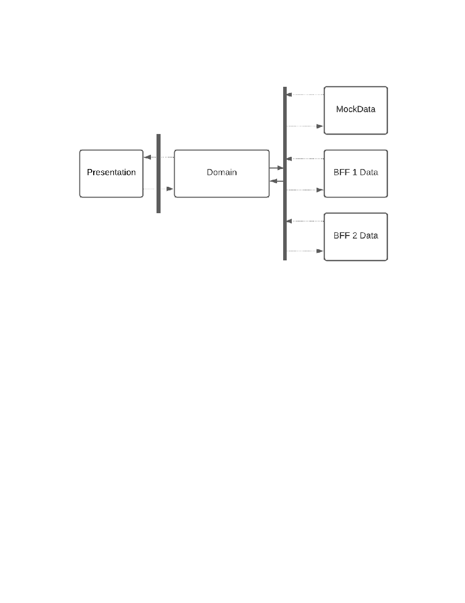

Portable Frontends

Hoisting the Application out of the Component

[Diagrams](https://lucid.app/lucidchart/81785baf-9f1b-46c6-9a3c-39ef6f53c856/edit?beaconFlowId=0CF494BB7DFECAAF&page=zSkUlb7R0UyB#)

Hello. My name is Josh Cox, a staff engineer on Llama Pod. Our pod is
responsible for program

configuration; in addition to the activity and exercise services, we own
an application named

Configurator, which is a content management system that gives Physical
Therapists and Health

Coaches the ability to modify... or configure... base Activity Plans and
user-specific Activity

Plans.

Today I'm going to be talking about portable frontend assets. I'm
convinced that a strategy of

hoisting application details out of components unlocks a huge amount of
flexibility when sharing

components. If done intentionally, this process helps to define layers
within the frontend with

well defined interfaces that, in turn, can also be exposed to enable
engineering consumers to

easily build concept-specific user interfaces.

But first... What do I mean by \`Portable'?

Portable means "able to be transferred from one machine or system to
another." In the context

of this talk, an application that is portable is one that is "able to be
rendered in more than one

application". There are three use-cases that I'm targeting in this talk.

Stand up the application by itself

Embed the application within another application (shallow embedding)

Implement custom workflows and user interfaces (deep embedding)

An application's discrete sub-components can be imported and stitched
together to form new

workflows and user interfaces.

Don't assume how consumers will use your code

By developing in a manner that enables each of the three scenarios
above, there are no

high-level assumptions about how a consumer embeds applications or
imports and uses

components. In my experience, there often seems to be a consumer
somewhere and they're

always doing something weird to load an application (or pieces of it)
into their own application.

By following some rules, we can enable our consumers. We can expose both
a high-level

application that can be stood up alone or embedded within other
applications with minimal effort.

We can expose a library of contextually-significant reusable components
that can be used to

seamlessly integrate our domain/context into others.

To achieve the portability displayed above, we don't need to change
much. This can be

achieved by using concepts and dependencies that we already have. So
let's dive in.

Expose the Sum & its Parts

The process of building an application generally is a process of
creating a rich library of

components, internal to the application. This includes hooks, Providers,
UI Components, and

more. Make them public. Expose an application and a library of
components and utilities that

can be used to build similar applications.

Building this library has positive consequences other than just enabling
consumers. Notably, it's

ideal for rendering in isolated environments (Storybook, unit testing).

Evaluate Dependencies

Every dependency has a compatibility cost when it comes to portability,
some more than others.

On the left, there are dependencies that either define or have an effect
on the environment

(TypeScript, React, etc); we'll call these \`prerequisites' - any
environment that this library will be

used in ought to satisfy these requirements. On the right, there are
dependencies (lodash,

formik) that can be used internally within components (operating as
black boxes), hidden from

consumers. Leaking data from internal dependencies is not recommended.

Prerequisites need to be relatively consistent across all applications.
If maintenance is a

concern, static analysis can be used to audit versioning of common
dependencies. The

remainder of this talk assumes a consistent environment made up of the
dependencies listed on

the left.

A Note on Peer Dependencies

Dependencies that define or affect the environment are often listed in a
package's [Peer](https://nodejs.org/es/blog/npm/peer-dependencies/)

[Dependencies](https://nodejs.org/es/blog/npm/peer-dependencies/), a
concept in NPM that is used to specify that a dependency will be
provided by

the target environment. Peer Dependencies may or may not be the best
choice, depending on

the version of NPM.

Peer Dependencies in NPM v4-v6

Peer Dependencies in NPM v4-v6 are not enforced by anything but a
warning message and are

not automatically installed when running npm install. Because of this,
people often will add peer

dependencies to the dev dependencies to ensure that peers are installed
for local development.

Unfortunately,
[linking](https://docs.npmjs.com/cli/v7/commands/npm-link) multiple
local packages together causes duplicate npm modules of the

peer dependencies. This sometimes necessitates extra configuration
(generally, aliasing a

dependency's name to a specific location/version in a bundler).

While peer dependencies work in a pinch, I believe when exploring the
idea of distributing

frontend resources across packages that it's prudent to forego peer
dependencies in favor of

legitimate dependencies with versions that we have consensus upon (like
React, UI Libraries,

etc). Using real dependencies enforces version ranges and ultimately
fails faster when

encountering incompatible dependencies.

Peer Dependencies in NPM v7

NPM made significant changes to [Peer Dependencies in
v7](https://github.blog/2021-02-02-npm-7-is-now-generally-available/#peer-dependencies)
([RFC
0025)](https://github.com/npm/rfcs/blob/latest/implemented/0025-install-peer-deps.md).
The changes

introduced in v7 include automatically installing peer dependencies as
well as blocking

installation when peer dependencies have upstream dependency conflicts.

The Layers of an Application

We established earlier that the plan is to break down the application
into sub-components that

will be exposed as a library. The first step is to slice up the
application into layers that have

general responsibilities within the application. A common pattern is to
divide the frontend into

three general layers: presentation, domain, and data (see [Presentation
Domain
Layering](https://martinfowler.com/bliki/PresentationDomainDataLayering.html),
[Apollo](https://www.apollographql.com/blog/apollo-client/architecture/client-side-architecture-basics/)

[Client-side
Architecture](https://www.apollographql.com/blog/apollo-client/architecture/client-side-architecture-basics/)).

An application that has been organized into discrete layers that only
communicate through

well-defined interfaces.

Allows for focusing scope of attention to one layer, independent of
other concerns

Layers can be substituted, so long as the interface matches

Data

The data layer is a set of functions or utilities that are responsible
for accessing and editing the

underlying model (a frontend API). This API is utilized by the domain to
pull data into the

application from outside.

Since the data API has a well-defined interface, it can be swapped out
for an alternative data

layer so long as the contract is fulfilled. This can be done when
testing or developing the

Domain and/or the Presentation to create a mock version of the
application that isn't connected

to any real data source. Alternatively, one could implement a new data
layer that utilizes a

different data source. This allows us to switch out one BFF for another
and also unlocks the

ability to use the Presentation & Domain in an entirely different
application.

Presentation

The presentation layer is responsible for displaying a user interface.
It's a collection of

components that are free from outside context. Data and behaviors are
passed (injected) into

the component via props. State that is strictly local to the component
belongs in the component,

but state that is outside the scope of the component is passed into the
component via props.

Hoisting state, data, and behavior out of a component leaves a component
that is purely UI.

Context-free components have several benefits. They can be used in any
application or library

with matching prerequisites, they compose well, and their isolated
nature lends well to testing.

Hoisting the Application out of the Component

Follow these steps to factor out an application-free component.

1\. Determine external dependencies within the component

a\. State that is not local (Context, hooks, etc)

b\. Data that is fetched from a network resource

c\. Handlers that affect state that is not local or make network
requests

2\. Refactor the component to receive these dependencies as props

a\. Handlers passed in as functions (ex. onDuplicateProgression,
onDeleteExercise)

b\. Data and state passed in as... data.

3\. Refactor the parent to pass in the data and behavior.

Domain

The Domain forms the brains of the application. So far, we've described
the Data and

Presentation layers, both of which are unable to do anything. The
Presentation needs to be told

what data to display and how to handle interactions. The Data API needs
to be called. The

Domain is the layer that "glues" the Data and Presentation together to
create a cohesive

application.

The Domain has access to the Data API and uses it to populate the
application's state. A

component connects the domain to the presentation by providing the data
to be rendered and

handlers for UI interactions that affect the application state.

Summary

That's it for a general overview. The idea here is to create a rich
frontend ecosystem that is

consistent and portable (within our ecosystem). We've discussed three
scenarios for rendering

user interfaces: standalone, embedding, and custom integration. We
discussed how exposing

the sum of the application and its parts, the subcomponents, sets
consumers up for any of those

three scenarios. We've briefly touched on dependencies and how we might
synchronize or trim

them to ensure a consistent environment from application to application.
And finally, we

discussed a method of layering the frontend such that layers can be
independently exposed

from the application library. I hope you enjoyed the talk. Any
questions?

------------------------------------------------------------------------

# Document Outline

- [Portable Frontends](frontend-portability-pattern.html#1)
  - [þÿ](frontend-portability-pattern.html#1)
    - [þÿ](frontend-portability-pattern.html#1)
    - [þÿ](frontend-portability-pattern.html#2)
    - [þÿ](frontend-portability-pattern.html#2)
    - [þÿ](frontend-portability-pattern.html#2)
  - [Expose the Sum & its Parts](frontend-portability-pattern.html#3)
  - [Evaluate Dependencies](frontend-portability-pattern.html#3)
    - [A Note on Peer Dependencies](frontend-portability-pattern.html#4)
      - [Peer Dependencies in NPM
        v4-v6](frontend-portability-pattern.html#4)
      - [Peer Dependencies in NPM
        v7](frontend-portability-pattern.html#4)
  - [The Layers of an Application](frontend-portability-pattern.html#4)
    - [Data](frontend-portability-pattern.html#5)
    - [Presentation](frontend-portability-pattern.html#6)
      - [Hoisting the Application out of the
        Component](frontend-portability-pattern.html#6)
    - [Domain](frontend-portability-pattern.html#8)
  - [Summary](frontend-portability-pattern.html#9)
