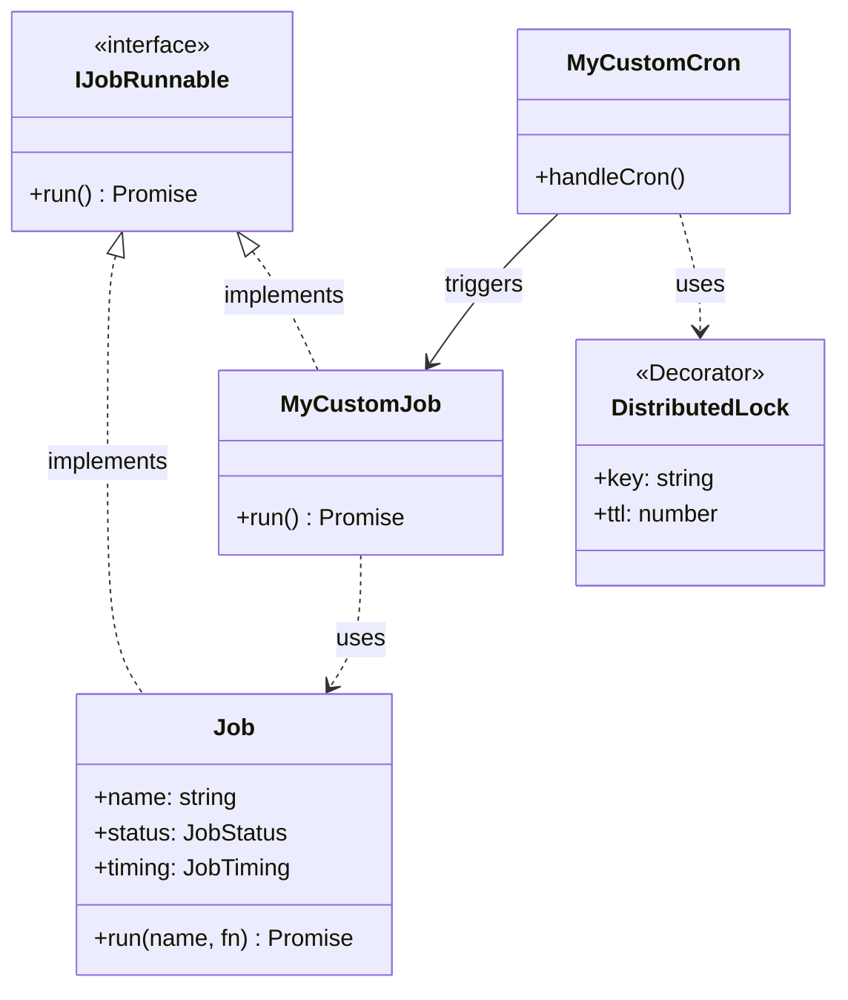
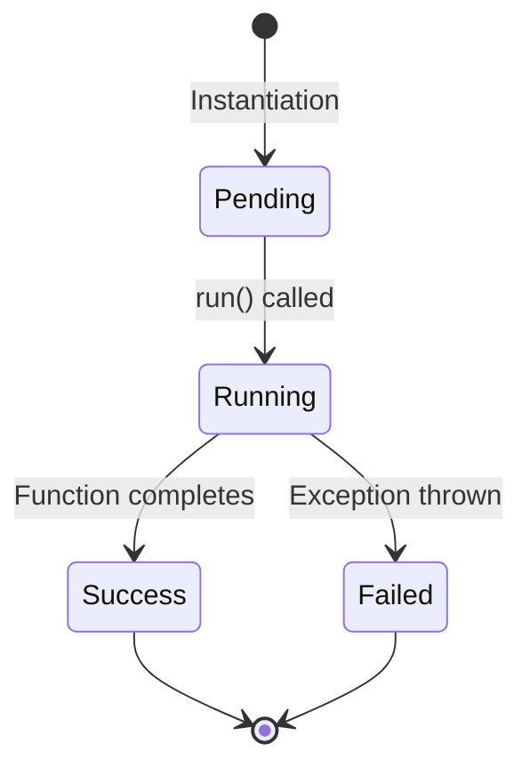

# Technical Strategy: Job Execution Framework

## 1. Overview
This document outlines the standardized strategy for implementing, executing, and monitoring background jobs within a service. Our goal is to provide a unified framework that abstracts away the complexities of observability, concurrency control, and error handling, allowing engineers to focus on the core business logic of their tasks.

## 2. Implementation Strategy
We utilize a composition-based pattern for our jobs. Rather than forcing inheritance from a rigid base class, we define jobs as injectable services that implement a lightweight interface (`IJobRunnable`) and utilize a `Job` utility class to wrap execution logic. This approach favors flexibility and testability, allowing dependencies to be injected naturally while ensuring that every background task adheres to a strict contract of behavior.

When an engineer identifies a need for a background task, the workflow begins by defining a dedicated service for that job. This service encapsulates the specific business logic required—whether it be data pre-generation, report compilation, or cleanup tasks. The core execution logic is then wrapped in our `Job.run()` static method. This wrapper is the critical "safety harness" of our system; it automatically handles performance timing, status tracking, and Datadog tracing integration. By wrapping the logic, we ensure that no matter how complex the internal operations are, the external system always receives a standardized report of what happened.

### Definition of Done Checklist
Before a new job is merged, it must satisfy the following criteria:
*   **Composition:** The service implements `IJobRunnable<T>` and uses `Job.run()` to wrap execution.
*   **Visibility:** The `Job` wrapper is confirmed to log "Job started", "Job succeeded/failed", and duration to stdout.
*   **Concurrency:** If the job is scheduled via Cron, the `@DistributedLock` decorator is applied with an appropriate TTL.
*   **Error Handling:** The triggering layer (Cron/Controller) explicitly checks for `status === 'failed'` and throws an error to upstream monitoring.
*   **Tracing:** Datadog traces are verifying correct operation in a local or staging environment.

## 3. Observability & Operations
A job that runs silently is a liability. We enforce strict observability requirements to ensure that we can distinguish between a quiet system and a broken one.

### Standardized Logging & Tracing
Every job execution must emit a standardized set of logs to standard output. This serves as our primary line of defense for debugging and immediate visibility. The `Job` class automatically handles this, emitting logs for initialization, completion, and failure. Critically, these logs include the duration of execution, which allows us to track performance regression over time.

In parallel with logs, every job is automatically wrapped in a Datadog trace. This trace allows us to visualize the job's execution path across services and databases, providing deep insight into bottlenecks.

### Error Propagation Policy
Our `Job` wrapper is designed to be "safe" internally—it catches exceptions to return a structured result object rather than crashing the process. However, this safety can lead to "silent failures" where the monitoring system believes everything is fine because no unhandled exception bubbled up.

To prevent this, the **consumer** of the job (the Cron handler or API Controller) is strictly required to unwrap this result. If the job result indicates failure, the consumer must throw an exception. This deliberate re-throwing ensures that error tracking systems like Sentry and the NestJS global exception filters are triggered, alerting the on-call team to the failure.

## 4. Integration Points

### Cron Integration (Automated)
When attaching a job to the NestJS scheduler, we must account for our distributed infrastructure. Since our service runs as multiple replicas in Kubernetes, a standard `@Cron` decorator would cause every pod to execute the job simultaneously. This is rarely desired and often dangerous.

To solve this, we mandate the use of the `@DistributedLock` decorator on all Cron handlers. This decorator leverages Redis to acquire a mutual exclusion lock for a specific key. If a pod attempts to run a job while the lock is held, it will log a warning and skip execution. This ensures that exactly one instance of the job runs across the entire cluster, regardless of replica count or deployment rollouts.

### API Integration (Manual)
Jobs are often required to be triggered manually by operations teams or other services. We expose these via standard REST controllers. Because our current implementation is synchronous, the API request will stay open until the job completes.

For short-running jobs, this is acceptable. The controller should return the structured `JobDto`, allowing the caller to immediately see the success or failure status. For long-running jobs, engineers should be aware that HTTP timeouts may occur. In the future, we will move to an asynchronous pattern (see Appendix) to handle these cases more gracefully.

## 5. Appendix: Technical Design

### Artifact: Domain Model
The relationship between the core components is defined as follows:

### Artifact: State Flow
The lifecycle of a job execution follows a strict linear progression.

### Artifact: Persistent Model (Future State)
To support long-running jobs and history tracking, we will introduce a persistence layer. This moves us from an ephemeral in-memory model to an asynchronous polling model.

**Table:** `job_executions`

| Column | Type | Description |
| :--- | :--- | :--- |
| `id` | UUID (PK) | Unique identifier for the execution |
| `job_name` | VARCHAR | Name of the job (e.g., 'pregenerate-configs') |
| `status` | ENUM | 'PENDING', 'RUNNING', 'COMPLETED', 'FAILED' |
| `started_at` | TIMESTAMP | When execution began |
| `completed_at` | TIMESTAMP | When execution finished |
| `result` | JSONB | Arbitrary output data or error details |
| `triggered_by` | VARCHAR | User ID or 'SYSTEM' (Cron) |
